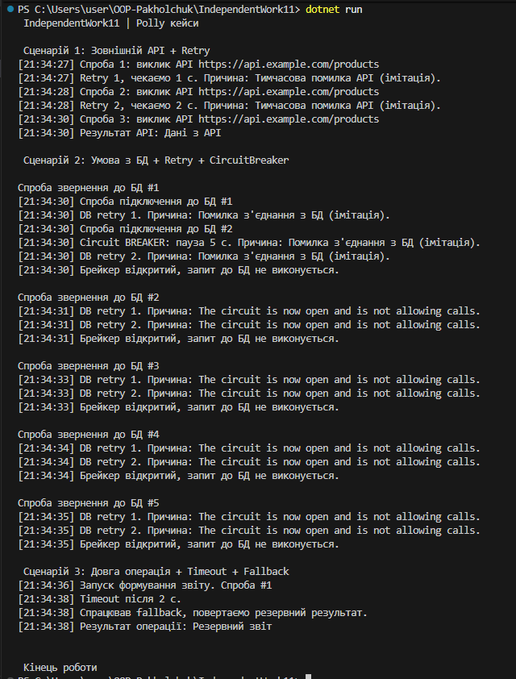

# Самостійна робота №11  
Тема: Кейси Polly / Retry

## 1. Мета роботи
У роботі я розглянув практичні ситуації, де в .NET можна використати Polly для підвищення відмовостійкості. Основний акцент – на політиках Retry, CircuitBreaker і Timeout.

## 2. Сценарій 1: Виклик зовнішнього API (Retry)
### Проблема
Зовнішній API може відповідати помилками, тому запит треба повторювати кілька разів.

### Політика
Retry з експоненційною затримкою. Пауза між спробами зростає: 1с → 2с → 4с.

### Реалізація
Перші дві спроби спеціально кидають помилку HttpRequestException. На наступних спробах запит відпрацьовує. У консолі видно всі повторні спроби.

## 3. Сценарій 2: Підключення до бази даних (Retry + CircuitBreaker)
### Проблема
Кілька підряд невдалих підключень можуть означати, що БД тимчасово недоступна.

### Політика
Комбінація Retry та CircuitBreaker.  
Retry робить повторні спроби, а CircuitBreaker блокує звернення, якщо помилки не припиняються.

### Реалізація
Перші спроби підключення падають. Коли їх набирається забагато, брейкер спрацьовує і блокує подальші виклики. Після тайм-ауту брейкер скидається.

## 4. Сценарій 3: Довга операція (Timeout + Fallback)
### Проблема
Операція може зависати на кілька секунд і блокувати програму.

### Політика
Timeout, який обриває надто довгу операцію, і Fallback, який повертає резервний результат замість помилки.

### Реалізація
Операція затримується приблизно на 5 секунд, але таймаут виставлено на 2 секунди. Через це спрацьовує Timeout, після чого Fallback повертає резервний рядок.

## 5. Приклад роботи програми

## 6. Висновки
Polly спрощує роботу з помилками і дозволяє будувати більш надійні застосунки.  
У всіх сценаріях політики поводились передбачувано: виконували повтори, блокували нестабільні операції або повертали fallback. Завдяки цьому можна комфортно працювати з API, базами даних і довгими операціями, не пишучи купу обробки вручну.
