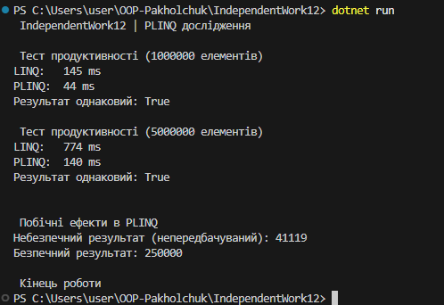

# Самостійна робота №12  
Тема: PLINQ – дослідження продуктивності та безпеки

## 1. Мета роботи
Мета роботи — зрозуміти, як поводиться PLINQ у порівнянні зі звичайним LINQ, чи реально він швидший на великих обсягах даних, і які можуть виникати проблеми з потокобезпекою.

## 2. Колекції та обчислення
Для тестів я створив великі списки на 1 млн і 5 млн елементів.  
Для кожного елемента виконувався важчий розрахунок — перевірка, чи є число простим.  
Одні й ті ж операції я запускав двома способами:
 через стандартний LINQ
 через PLINQ (AsParallel)

Час міряв StopWatch.

## 3. Результати
На колекціях великого розміру PLINQ працював швидше, бо задача досить важка і добре ділиться між потоками.  
Стандартний LINQ працює рівно, але повільніше.  
На менших колекціях різниця не така велика, інколи LINQ навіть не гірший.

У консольному виводі видно час виконання обох варіантів і факт, що результати збіглися.

## 4. Побічні ефекти і проблема потокобезпеки
Окремо я показав приклад, де PLINQ дає неправильний результат, якщо кілька потоків змінюють спільну змінну.  
Змінна `unsafeCounter` рахує кількість парних чисел, але значення виходить різним при кожному запуску.

Щоб це виправити, я використав звичайний `lock`. Після цього підрахунок став стабільним і правильним.

## 5. Приклад роботи програми
Скріншот виводу лежить у папці media.

## 6. Висновки
PLINQ дає хороший приріст продуктивності, коли:
 операція справді важка
 обсяг даних великий
 обчислення можна без проблем виконувати паралельно

Водночас PLINQ вимагає уважності до потокобезпечності, бо будь-які побічні ефекти в лямбда-виразах можуть зламати результат.  
У цілому PLINQ — корисний інструмент, але треба розуміти його особливості і не використовувати там, де паралельність не дає реальної користі.
