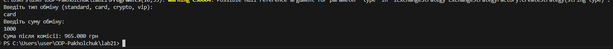

Лабораторна робота №21  
Тема: OCP: гнучкі алгоритми розрахунку (Factory / Strategy)
Мета роботи  
Метою лабораторної роботи є вивчення принципу відкритості/закритості (OCP) та його застосування на практиці. У роботі реалізовано систему, яку можна розширювати новими алгоритмами без зміни вже існуючого коду.
Опис роботи  
У даній лабораторній роботі реалізовано систему конвертації валют з урахуванням комісії. Для кожного типу обміну використовується окрема стратегія розрахунку комісії.
Було створено інтерфейс IExchangeStrategy, який містить метод для розрахунку суми після комісії. Кожен тип обміну реалізований в окремому класі, що дозволяє легко додавати нові варіанти без зміни основної логіки програми.

Реалізовані стратегії:
StandardExchange – стандартний обмін з базовою комісією  
CardExchange – обмін через банківську картку з підвищеною комісією  
CryptoExchange – обмін криптовалюти з більшою комісією  
VipExchange – додаткова стратегія, додана для демонстрації розширюваності системи  

Для створення потрібної стратегії використовується клас ExchangeStrategyFactory. Він повертає відповідну стратегію залежно від типу обміну, який вводить користувач.
Клас ExchangeService відповідає за виконання розрахунку і працює тільки з інтерфейсом стратегії, що відповідає принципу OCP.
Демонстрація роботи  

Користувач вводить тип обміну та суму. Програма використовує фабрику для створення відповідної стратегії та виводить суму після комісії в консоль.
Результат роботи програми наведено на скріншоті:

Висновок  
У ході виконання лабораторної роботи було реалізовано систему розрахунку з використанням патернів Strategy та Factory Method. Програма відповідає принципу відкритості/закритості, оскільки нові типи обміну можна додавати без зміни вже написаного коду.
