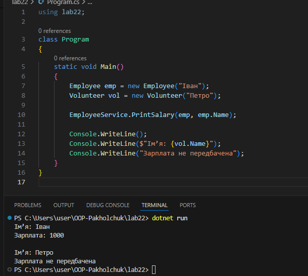

# Лабораторна робота №22
**Тема:** LSP: виявлення порушень і альтернативи  
**Мета:** Поглибити розуміння принципу підстановки Лісков (LSP), навчитися виявляти його порушення в ієрархіях класів та застосовувати альтернативні підходи для створення коректних рішень.

## 1. Опис початкової ієрархії класів та порушення LSP
У початковому варіанті була реалізована ієрархія класів, що складається з базового класу Employee та похідного класу Volunteer. Базовий клас Employee містить метод CalculateSalary(), який за контрактом повинен повертати заробітну плату співробітника. Клієнтський код, що працює з об’єктами типу Employee, очікує, що виклик цього методу завжди є коректним і повертає осмислений результат.  
Однак клас Volunteer є похідним від Employee, хоча волонтери не отримують заробітну плату. У такому випадку метод CalculateSalary() у класі Volunteer або повертає 0, або взагалі не має логічної реалізації, що порушує контракт базового класу Employee. Таким чином, підстановка об’єкта Volunteer замість Employee призводить до некоректної поведінки програми, що є прямим порушенням принципу підстановки Лісков (LSP).

## 2. Аналіз порушення принципу підстановки Лісков
Принцип LSP стверджує, що об’єкти похідного класу повинні без проблем замінювати об’єкти базового класу без зміни коректності роботи програми. У даній ієрархії цей принцип порушується, оскільки базовий клас Employee гарантує наявність зарплати, похідний клас Volunteer не може виконати цей контракт, а клієнтський код змушений враховувати тип об’єкта, що суперечить ідеї поліморфізму. Отже, проблема полягає в неправильному використанні наслідування.

## 3. Альтернативне рішення, що дотримується LSP
Для усунення порушення LSP було обрано підхід зміни ієрархії класів. Замість наслідування Volunteer від Employee було введено окремий інтерфейс або абстракцію, яка визначає можливість отримання зарплати. У результаті лише оплачувані співробітники реалізують метод розрахунку зарплати, волонтери не зобов’язані реалізовувати метод, який їм логічно не підходить, а клієнтський код працює тільки з тими об’єктами, які реально підтримують потрібний контракт. Таке рішення відповідає принципу підстановки Лісков.

## 4. Фрагменти коду
### Початковий варіант (з порушенням LSP)
```csharp
public class Employee
{
    public string Name { get; set; }

    public virtual double CalculateSalary()
    {
        return 1000;
    }
}

public class Volunteer : Employee
{
    public override double CalculateSalary()
    {
        throw new NotSupportedException("Волонтер не отримує зарплату");
    }
}
```
### Виправлений варіант (LSP-дружнє рішення)
```csharp
public interface IPaidEmployee
{
    double CalculateSalary();
}

public class Employee : IPaidEmployee
{
    public string Name { get; set; }

    public double CalculateSalary()
    {
        return 1000;
    }
}

public class Volunteer
{
    public string Name { get; set; }
}
```
Клієнтський код тепер працює лише з інтерфейсом IPaidEmployee, що виключає логічні помилки та порушення контрактів.
## 5. Демонстрація коректної роботи програми
У методі Main створюються об’єкти співробітника та волонтера. Для співробітника коректно обчислюється заробітна плата, а волонтер обробляється окремо без виклику методу розрахунку зарплати. Результат виконання програми виводиться в консоль та демонструє коректну роботу після рефакторингу.



## 6. Висновки
У ході виконання лабораторної роботи було виявлено порушення принципу підстановки Лісков у початковій ієрархії класів. Було проаналізовано причину проблеми та запропоновано альтернативне рішення шляхом зміни ієрархії класів. Застосування коректної архітектури дозволило усунути логічні помилки, підвищити гнучкість коду та зробити його більш зрозумілим і масштабованим. Принцип LSP є важливою складовою об’єктно-орієнтованого програмування, оскільки забезпечує надійність і передбачуваність поведінки системи.