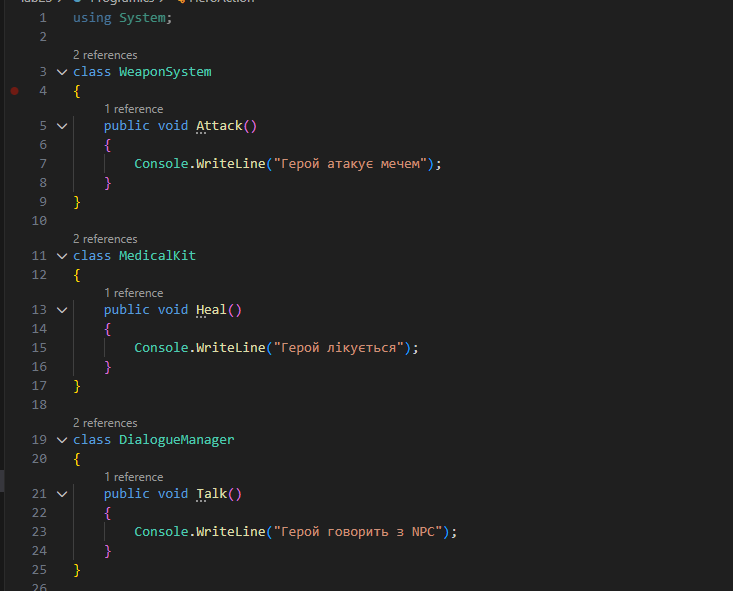
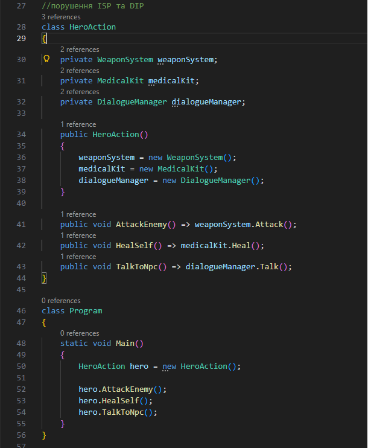
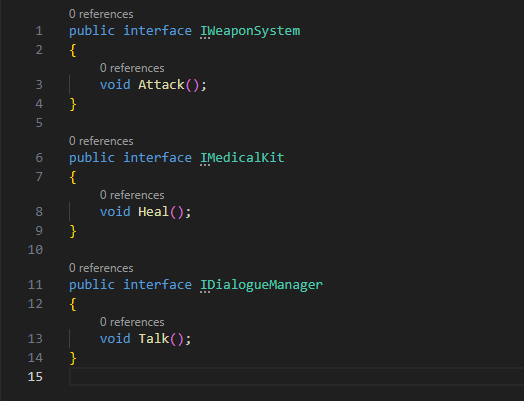
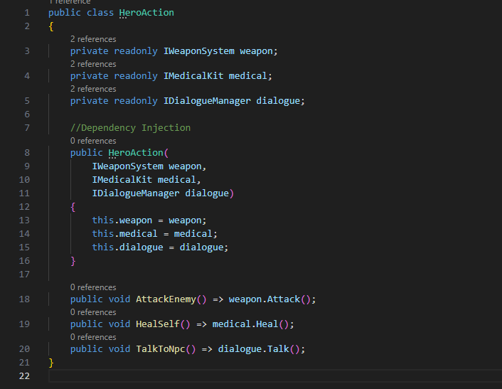
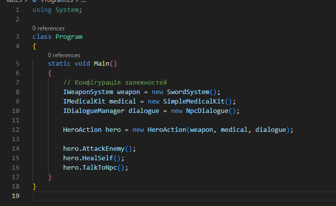
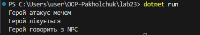

# Лабораторна робота №23

## Тема
ISP & DIP: рефакторинг і DI через конструктор

## Мета роботи
Застосувати принцип розділення інтерфейсу (ISP) та принцип інверсії залежностей (DIP), виконати рефакторинг коду і реалізувати Dependency Injection через конструктор для зменшення зв’язаності між класами.

## Опис початкової реалізації

Було реалізовано клас HeroAction, який виконує такі дії:
- атака ворога;
- лікування персонажа;
- взаємодія з NPC.

Клас напряму створював свої залежності:
- WeaponSystem
- MedicalKit
- DialogueManager

### Виявлені проблеми
- усі залежності створювались всередині класу через new;
- навіть персонаж, який тільки атакує, залежав від системи діалогів;
- клас був жорстко зв’язаний із конкретними реалізаціями.

### Скрін початкової реалізації

## Аналіз порушення ISP

Принцип ISP стверджує, що клієнт не повинен залежати від методів, які він не використовує.

У початковій реалізації:
- клас залежав від усіх систем одночасно;
- навіть якщо діалоги не використовуються, залежність усе одно існувала.

У результаті клас був змушений працювати з функціональністю, яка йому фактично не потрібна.

## Аналіз порушення DIP

Принцип DIP визначає, що модулі високого рівня повинні залежати від абстракцій, а не від конкретних реалізацій.

Проблеми реалізації:
- HeroAction створював конкретні класи через new;
- будь-яка зміна реалізації вимагала зміни самого класу;
- ускладнювалось тестування та розширення програми.

## Рефакторинг (ISP)

Було створено вузькоспеціалізовані інтерфейси:
- IWeaponSystem
- IMedicalKit
- IDialogueManager

Це дозволило розділити функціональність на незалежні частини та використовувати лише необхідні можливості.

### Скрін інтерфейсів

## Рефакторинг (DIP та Dependency Injection)

Після рефакторингу клас HeroAction більше не створює залежності самостійно.

Тепер вони передаються через конструктор:
- клас залежить від інтерфейсів, а не від конкретних класів;
- конкретні реалізації задаються зовні;
- зменшилась зв’язаність між модулями.

### Скрін HeroAction

## Конфігурація залежностей у Main

У методі `Main` створюються необхідні об’єкти та передаються у клас через конструктор.

Таким чином реалізовано Dependency Injection — головний клас отримує вже готові залежності, а не створює їх сам.

### Скрін Program.cs

## Демонстрація роботи програми

Після запуску програми персонаж коректно виконує свої дії:
- атакує;
- лікується;
- взаємодіє з NPC.

### Скрін результату роботи

## Висновки

У ході лабораторної роботи було досліджено порушення принципів ISP та DIP та виконано рефакторинг системи.

Після застосування ISP:
- залежності стали розділеними;
- класи використовують лише необхідну функціональність.

Після застосування DIP та Dependency Injection:
- зменшилась зв’язаність між компонентами;
- код став гнучкішим;
- спростилось тестування та подальше розширення системи.

Застосування принципів SOLID дозволяє створювати більш масштабовану та підтримувану архітектуру програмного забезпечення.
