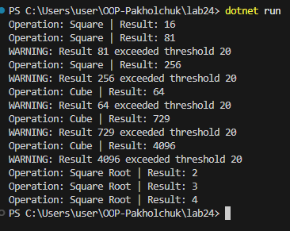

# Лабораторна робота №24

## Тема
Strategy + Observer: динамічна підстановка алгоритмів

## Мета роботи
Реалізувати патерни Strategy та Observer для створення системи обробки числових даних з можливістю зміни алгоритмів під час виконання та автоматичного сповіщення про результати.

---

## Реалізація Strategy

Було створено інтерфейс `INumericOperationStrategy`, який визначає метод виконання операції над числом.

Реалізовано три стратегії:
- Square — квадрат числа;
- Cube — куб числа;
- Square Root — квадратний корінь.

Клас `NumericProcessor` дозволяє змінювати стратегію під час виконання за допомогою методу `SetStrategy()`.

---

## Реалізація Observer

Створено клас `ResultPublisher`, який використовує подію `ResultCalculated`.

Observer-и:
- ConsoleLoggerObserver — вивід результату;
- HistoryLoggerObserver — збереження історії;
- ThresholdNotifierObserver — повідомлення при перевищенні порогу.

Після кожного обчислення викликається подія, і всі підписники автоматично отримують результат.

---

## Демонстрація роботи (Main)

У методі Main було:
- створено NumericProcessor та ResultPublisher;
- створено Observer-и та виконано підписку;
- встановлено різні стратегії;
- виконано обробку кількох чисел;
- результати виведено в консоль.

---

## Результат виконання

---

## Висновок

У ході роботи було реалізовано патерни Strategy та Observer.  
Strategy дозволив динамічно змінювати алгоритм обробки даних, а Observer — автоматично повідомляти залежні компоненти через події C#.