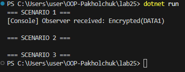
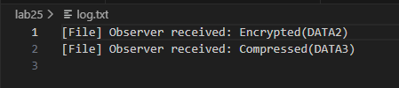

# Лабораторна робота №25

## Тема
Інтеграція патернів: Factory Method, Singleton, Strategy, Observer

## Мета роботи
Реалізувати систему, яка демонструє взаємодію патернів Factory Method, Singleton, Strategy та Observer, а також перевірити можливість динамічної зміни алгоритмів обробки даних і способу логування під час виконання програми.

## Реалізація Strategy

Патерн Strategy використано для зміни способу обробки даних без зміни основної логіки програми.
Було створено інтерфейс `IDataProcessorStrategy`, який визначає метод: Process(string data)
Реалізовано дві стратегії:

- `EncryptDataStrategy` — умовне шифрування даних;
- `CompressDataStrategy` — умовне стиснення даних.

Клас `DataContext` приймає стратегію через конструктор та дозволяє змінювати її під час виконання за допомогою методу `SetStrategy()`.

## Реалізація Observer

Патерн Observer реалізовано за допомогою подій C#.
Було створено клас `DataPublisher`, який містить подію:
Реалізовано дві стратегії:

- `EncryptDataStrategy` — умовне шифрування даних;
- `CompressDataStrategy` — умовне стиснення даних.

Клас `DataContext` приймає стратегію через конструктор та дозволяє змінювати її під час виконання за допомогою методу `SetStrategy()`.

## Реалізація Observer

Патерн Observer реалізовано за допомогою подій C#.
Було створено клас `DataPublisher`, який містить подію: DataProcessed
Після завершення обробки даних викликається подія, і всі підписані об’єкти автоматично отримують результат.
Observer:
- `ProcessingLoggerObserver` — підписується на подію та виконує логування результату.
Таким чином обробник даних не залежить від системи логування.

## Реалізація Factory Method

Патерн Factory Method використовується для створення різних типів логерів.
Було створено:
- інтерфейс `ILogger`;
- `ConsoleLogger` — вивід повідомлень у консоль;
- `FileLogger` — запис повідомлень у файл `log.txt`.

Також реалізовано фабрики:
- `ConsoleLoggerFactory`;
- `FileLoggerFactory`.

Фабрика дозволяє змінювати тип логера без зміни клієнтського коду.

## Реалізація Singleton

Для централізованого керування логуванням створено клас `LoggerManager`, який реалізує патерн Singleton.
Особливості:
- у програмі існує лише один екземпляр менеджера;
- всі компоненти отримують логер через `LoggerManager.Instance`;
- фабрику логера можна змінювати під час виконання програми.

## Демонстрація роботи (Main)

У методі `Main` було реалізовано три сценарії.

### Сценарій 1 — Повна інтеграція
- ініціалізовано `ConsoleLogger`;
- використано стратегію шифрування;
- Observer отримує подію та виводить результат у консоль.

### Сценарій 2 — Динамічна зміна логера
- фабрику логера змінено на `FileLoggerFactory`;
- подальші результати записуються у файл `log.txt`.

### Сценарій 3 — Динамічна зміна стратегії
- стратегія змінена на `CompressDataStrategy`;
- обробка виконується новим алгоритмом без зміни іншого коду.

## Результат виконання

### Запуск програми

Після запуску програми:
у консолі відображається результат першого сценарію, а результати наступних сценаріїв записуються у файл `log.txt`.

### Файл логування

Після виконання програми автоматично створюється файл `log.txt`, у якому містяться результати другого та третього сценаріїв.

## Висновок

У ході лабораторної роботи було реалізовано інтеграцію чотирьох патернів проєктування.
Патерн Strategy дозволив змінювати алгоритм обробки даних під час виконання програми.  
Observer забезпечив автоматичне повідомлення компонентів через події.  
Factory Method дозволив створювати різні типи логерів без зміни клієнтського коду.  
Singleton забезпечив використання єдиного менеджера логування у всій системі.
У результаті було створено гнучку систему, компоненти якої можуть змінювати поведінку без зміни основної архітектури програми.
