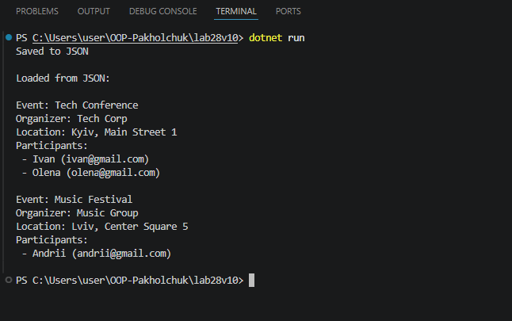
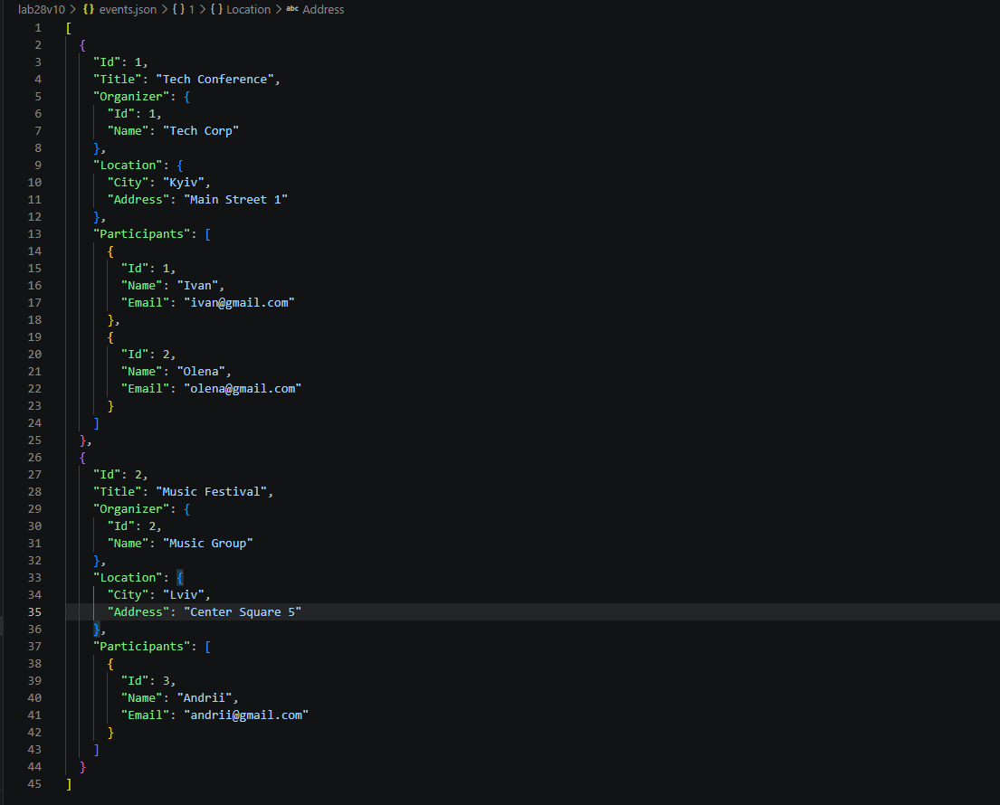

# Лабораторна робота №28

## Тема
Серіалізація об’єктів у JSON

## Мета роботи
Навчитися серіалізувати та десеріалізувати складні об’єкти у форматі JSON, зберігати дані у файли та завантажувати їх.

## Предметна область

Варіант 10 - Івенти.
Було реалізовано такі класи:

- Event - подія;
- Participant - учасник;
- Organizer - організатор;
- Location - місце проведення.

Клас Event містить вкладені об’єкти (Organizer, Location) та список учасників (Participants).

## Реалізація репозиторію

Було створено клас `EventRepository`, який містить:

- `Add()` - додавання події;
- `GetAll()` - отримання всіх подій;
- `GetById(int id)` - пошук події за id;
- `SaveToFileAsync(string filename)` - збереження у JSON файл;
- `LoadFromFileAsync(string filename)` - завантаження з JSON файлу.

Серіалізація реалізована за допомогою `System.Text.Json`.

## Демонстрація роботи (Main)

У методі Main було:

- створено кілька об’єктів Event;
- додано їх у репозиторій;
- виконано збереження у файл `events.json`;
- створено новий репозиторій;
- виконано завантаження даних з JSON;
- виведено результат у консоль.

## Результат виконання

### Запуск програми

Після виконання команди dotnet run
у консолі відображаються всі події та їх учасники.

### JSON файл

Після виконання програми створюється файл events.json
У ньому зберігаються всі об’єкти разом із вкладеними даними.

## Перевірка роботи

Було перевірено, що:
- дані коректно зберігаються у JSON файл;
- після очищення колекції вони завантажуються з файлу;
- зміни у JSON файлі відображаються у програмі після запуску.

## Висновок

У ході лабораторної роботи було реалізовано серіалізацію та десеріалізацію складних об’єктів у формат JSON.
Було створено систему з вкладеними об’єктами та списками, реалізовано асинхронне збереження та завантаження даних.
Отримано практичні навички роботи з JSON у C# та бібліотекою `System.Text.Json`.