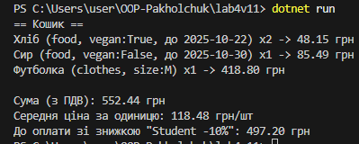

# Лабораторна робота №4  
**Тема:** Абстракції та інтерфейси. Композиція та агрегація  
**Мета:** Навчитися працювати з абстрактними класами, інтерфейсами, а також використовувати композицію та агрегацію для побудови зв’язків між класами.

---

## Опис виконання  
Я створив інтерфейс `IProduct` і абстрактний клас `Product`, який реалізує спільну логіку для товарів.  
На основі цього зробив два класи: `Food` і `Clothes`.  
Клас `Cart` містить список товарів (композиція) і виконує підрахунок суми, середньої ціни та знижки.  
Додатково створено інтерфейс `IDiscount` і клас `PercentageDiscount`, що дозволяє задавати знижку у відсотках.  
Для їжі враховується строк придатності та ПДВ 7%, для одягу — ПДВ 20%.  
Програма демонструє створення товарів, їх додавання в кошик, обчислення загальної суми, середньої ціни й кінцевої вартості зі знижкою.

---

## Висновки 

Під час виконання роботи я розібрався, як працюють абстрактні класи та інтерфейси, і зрозумів, коли доцільно застосовувати композицію чи наслідування.
Інтерфейс IDiscount показав, як можна робити код гнучким — додавати нові типи знижок без змін у самому кошику.

---
## Приклад запуску   

---
## Контрольні питання 
1.У чому різниця між абстрактним класом і інтерфейсом?
Абстрактний клас може мати змінні, реалізацію методів і конструктори, а інтерфейс — тільки сигнатури методів.

2.Коли краще використовувати композицію, а коли наслідування?
Наслідування використовують, коли клас є різновидом іншого, а композицію — коли один клас містить інший як частину.

3.Як працює агрегація та чим вона відрізняється від композиції?
В агрегації об’єкти можуть існувати самостійно, а в композиції — залежать від об’єкта, який їх містить.

4.Чи може клас реалізовувати кілька інтерфейсів одночасно?
Так, може. У C# це звичайна практика, якщо клас має різні обов’язки.

5.Для чого в ООП використовують інтерфейси як контракти?
Щоб задавати єдині вимоги для різних класів і легко змінювати реалізації, не змінюючи логіку програми.

---