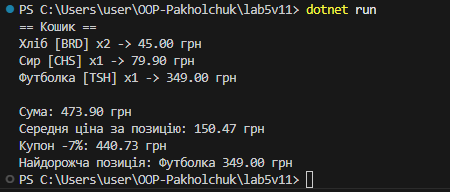

# Лабораторна робота №5  
## Generics, колекції, LINQ та винятки  
**Варіант 11 — Прайс-лист і кошик**

---

## Тема та мета роботи
У цій лабораторній я розібрався з узагальненими типами (Generics), колекціями, LINQ та обробкою винятків.  
Завдання — змоделювати прайс-лист і кошик покупця, виконати обчислення та реалізувати власні винятки.

---

## Що було зроблено

### 1. Сутності
- **PriceItem** — товар у прайсі (код, назва, ціна).  
- **CartItem** — позиція у кошику (код товару + кількість).

### 2. Агрегація
Кошик не зберігає товари всередині.  
Він лише посилається на елементи прайс-листа за кодами.

### 3. Узагальнений репозиторій
Реалізовано `Repository<T>` з методами:
- `Add`
- `Where`
- `FirstOrDefault`
- `All`

Через Generics репозиторій працює з будь-яким типом.

### 4. Обчислення (CartService)
- загальна сума  
- середня ціна за позицію  
- знижка купона −7%  
- пошук найдорожчого товару (LINQ MaxBy)

### 5. Власні винятки
- **InvalidQuantityException** — якщо кількість ≤ 0  
- **NotFoundException** — товар не знайдено в прайсі  

У `Program.cs` використано try-catch для обробки помилок.

---

## Приклад запуску

```

```

---

## Контрольні питання

### 1. Що таке generics і які їх переваги?
Generics дозволяють писати універсальний код для будь-якого типу.  
Переваги: безпека типів, відсутність кастування, менше дублювання коду.

### 2. Різниця між ArrayList і List<T>
`ArrayList` працює з object → треба приводити типи.  
`List<T>` одразу працює з конкретним типом → безпечно й швидко.

### 3. Чим Dictionary<TKey,TValue> відрізняється від List<T>?
`Dictionary` зберігає пари ключ-значення і дозволяє швидко шукати.  
`List<T>` — це просто послідовність елементів без ключів.

### 4. Перевага LINQ над циклами
LINQ дає коротший і зрозуміліший код, багато готових методів (Where, Select, Sum тощо).  
Не потрібно писати зайві цикли.

### 5. Як працює finally?
Виконується завжди — незалежно від того, був виняток чи ні.  
Зазвичай використовується для звільнення ресурсів.

### 6. Коли варто створювати власні винятки?
Коли стандартні винятки не описують конкретну помилку в твоїй логіці (наприклад, товар не знайдено або кількість неправильна).

---

## Висновки
У роботі я закріпив Generics, колекції, LINQ і механізм обробки винятків.  
Реалізована модель прайс-листа та кошика вийшла гнучкою, з нормальною обробкою помилок і чіткою логікою.  
Код легко розширюється та зрозумілий для подальших лабораторних.

