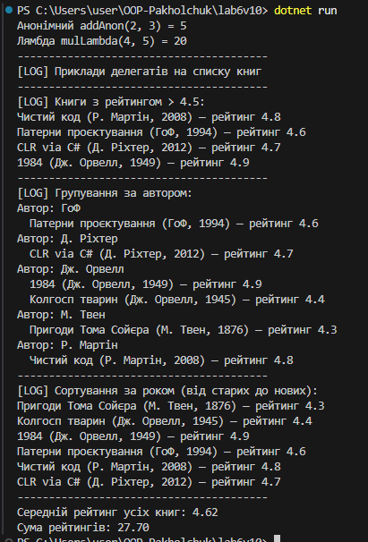

# Лабораторна робота №6
Тема: Лямбда-вирази, анонімні методи та делегати  
Варіант: 10  
Студент: Пахольчук Давид

---

## Мета роботи
Навчитись працювати з делегатами, анонімними функціями та лямбда-виразами. Розібрати, як використовуються стандартні делегати (Func, Action, Predicate) і як через них будувати просту обробку даних. Також потренуватись застосовувати LINQ до колекцій.

---

## Опис реалізації
Для варіанта №10 використовується модель книги.  
Створено клас Book з такими полями:

назва  
автор  
рік  
рейтинг  

Далі за допомогою лямбда-виразів та LINQ зроблено:

фільтрацію книг з рейтингом > 4.5  
групування за авторами  
сортування за роком видання  
підрахунок середнього рейтингу  
підрахунок сумарного рейтингу  

Також показано роботу власного делегата, анонімного методу та лямбда-функції.

---

## Приклади використаних делегатів

### Власний делегат
```
public delegate int IntOperation(int a, int b);
```

### Анонімний метод
```
IntOperation addAnon = delegate(int a, int b) { return a + b; };
```

### Лямбда-вираз
```
IntOperation mulLambda = (a, b) => a * b;
```

### Використання Func / Action / Predicate
```
Predicate<Book> highRate = b => b.Rating > 4.5;
Action<Book> show = b => Console.WriteLine($"{b.Title} — {b.Rating}");
Func<Book, double> selector = b => b.Rating;
```

---

## Приклад запуску програми

(Скріншот з консолі)



---

## Що було зроблено
Створено клас Book  
Показано приклади делегатів  
Використано анонімний метод  
Написано кілька лямбда-виразів  
Використано Func, Action та Predicate  
Виконано фільтрацію, групування, сортування і підрахунки через LINQ  
Вивід усіх результатів зроблено у Main()

---

## Контрольні питання

### 1. Що таке делегати?
Тип, який може зберігати посилання на метод. Дозволяє передавати методи як параметри.

### 2. Чим лямбда відрізняється від анонімного методу?
Лямбда — просто коротший і зручніший варіант анонімної функції.

### 3. Для чого потрібні Func, Action, Predicate?
Func повертає значення, Action нічого не повертає, Predicate використовується коли треба повернути true/false.

### 4. Чому LINQ зручний?
Бо дає можливість коротко писати фільтрацію, сортування й обробку колекцій, без зайвих циклів.

---

## Висновок
За цю роботу я розібрався з делегатами і лямбдами та попрактикував LINQ. Переконався, що з такими інструментами код стає коротшим і читабельнішим.  
