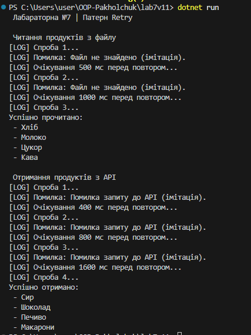

# Лабораторна робота №7  
Тема: Обробка IO/мережевих помилок та патерн Retry

## 1. Мета роботи
Мета роботи — розібратись, як у C# обробляються помилки, пов’язані з файлівими операціями та мережевими запитами, а також навчитися будувати патерн Retry з повторними спробами та затримками.

## 2. Що було виконано
Створив проєкт lab7v11 у рішенні OOP-Пахольчук.  
Реалізував клас FileProcessor, який імітує читання файлу та декілька разів навмисно кидає FileNotFoundException.  
Додав клас NetworkClient, який імітує мережевий запит і спочатку кидає HttpRequestException.  
Створив універсальний клас RetryHelper із повторними спробами, логуванням та експоненційною затримкою.  
У Program.cs перевірив роботу Retry для обох сценаріїв: читання файлу і запиту до API.  
Додав скрін виводу програми.

## 3. Короткий опис роботи класів

### FileProcessor
Містить метод, який перші кілька викликів імітує помилку читання файлу, а на наступній спробі повертає успішний результат. Це дозволяє нормально перевірити механізм повторних спроб.

### NetworkClient
Працює за аналогічним принципом, але вже для HttpRequestException. Так само спочатку повертає помилку, а потім успішно “віддає” дані.

### RetryHelper
Це універсальний клас з методом ExecuteWithRetry.  
Метод приймає операцію, яку треба виконати, кількість повторних спроб та затримку.  
При кожній невдалій спробі затримка збільшується (експоненційно).  
Також є можливість через делегат shouldRetry вказати, які винятки повторювати, а які — ні.

## 4. Приклад запуску програми

## 5. Контрольні питання

### 1. Які типи винятків найчастіше виникають при роботі з файлами та мережею?
При роботі з файлами — FileNotFoundException, DirectoryNotFoundException, IOException.  
При мережевих операціях — HttpRequestException, SocketException.

### 2. Поясніть принцип роботи патерну Retry. Коли його доцільно використовувати?
Retry — це механізм повторного виконання операції, яка могла тимчасово завершитися помилкою. Доцільно використовувати, коли проблема не є критичною і може “зникнути” після кількох повторних спроб, наприклад, мережеві збої або тимчасова відсутність файлу.

### 3. Як реалізувати експоненційну затримку між повторними спробами?
При кожній наступній спробі затримка множиться на 2 (або інший коефіцієнт). Наприклад: 500 мс, 1000 мс, 2000 мс і так далі.

### 4. Для чого потрібен делегат shouldRetry у RetryHelper?
Через shouldRetry можна задати правило, які винятки треба повторювати, а які — ні. Це робить Retry більш гнучким.

